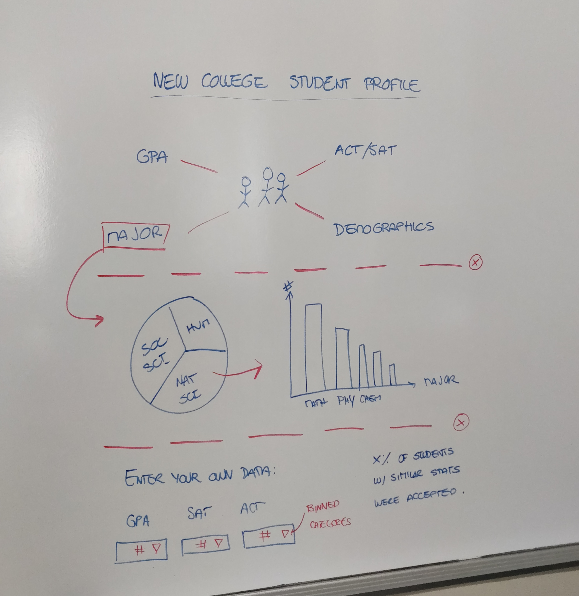
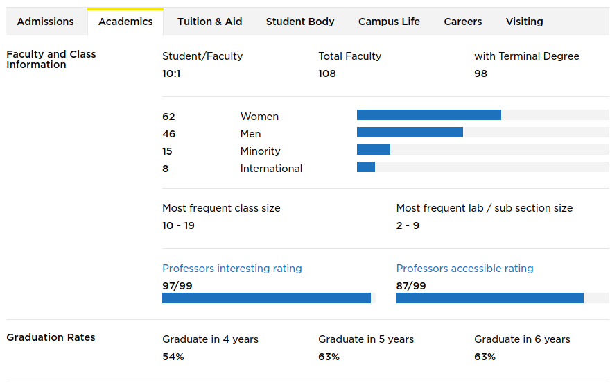
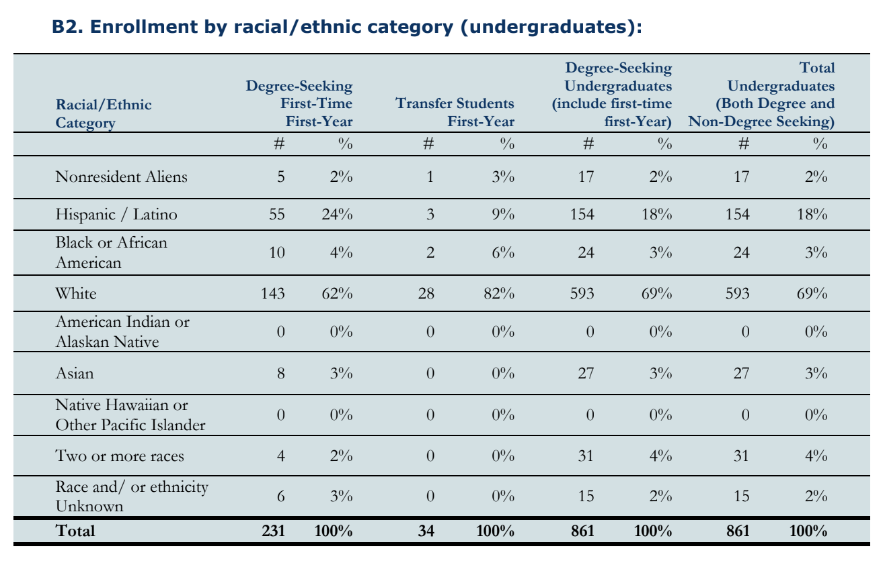

```{r setup, include=FALSE}
knitr::opts_chunk$set(echo = FALSE)
```

## Intro & Data

1. Admissions
    + `Decision` 
    + `Course Selection Rating` + `Final NCF GPA`
    + `ACT Composite` + `SAT R Superscore`
    + `Essay Rating`
2. Academics and Demographics
    + `Major`, `Class size`, `Student-Faculty Ratio`
    + `Gender`, `Race`, `Residence`, `Financial Aid`, `Age`
3. SAT, ACT, GPA 
    + `IQR`, `Mean`, `% SAT`, `% ACT`

## Goal and audience

Provide an at-a-glance way for prospective students to see what the average NCF student looks like and to see how they compare to the student body.

## Goal and audience

Provide an at-a-glance way for prospective students to see what the average NCF student looks like and to see how they compare to the student body.

### `The user can:`

1. Get stats for the average NCF student
2. Enter their own stats to see how they compare
3. Personalize their own dashboard with the information they want the most.

## Goal and audience

Provide an at-a-glance way for prospective students to see what the average NCF student looks like and to see how they compare to the student body.

### `The user can:`

1. Get stats for the average NCF student
2. Enter their own stats to see how they compare
3. Personalize their own dashboard with the information they want the most.

### `The school can:`

1. Have a way to present key facts of interest to the students from the factbook in a way that doesn't overwhelm.

## Overview and examples


***

<center></center>

***

<center></center>

***

<center></center>
***

<center></center>

## Discussion

### When you applied to college, what info did you wish you knew? 

### What information were you most interested in?

### Questions?

