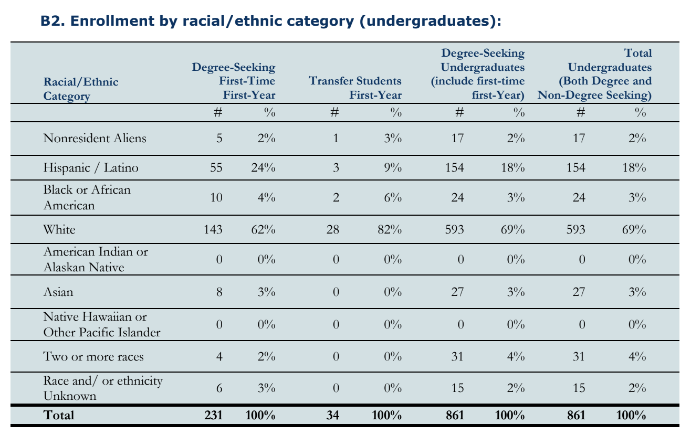
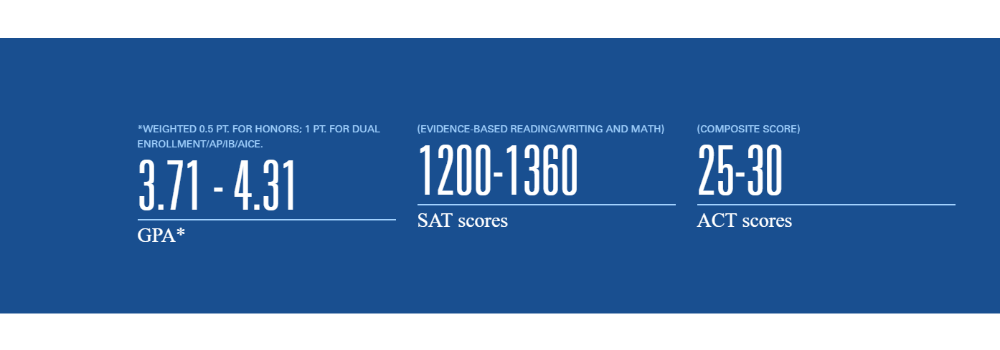

# Admissions-Data-Project
Repository for the second project of the Data Visualization class, Spring 2018.

**Group**: [Adriana Souza](https://github.com/acastrops), [Roger Filmyer](https://github.com/rfilmyer), [Lydia LaSeur](https://github.com/lydialaseur).

# Introduction 

College application time is a daunting period for everyone involved. For students, after 4 years of trying their best to be competitive, choosing the right college means sifting through tons of information that is either not collected in the same place or behind a paywall. For schools, it means making sure that all the information students need is available, up to date, and does not overwhelm.

This is the problem we are trying to solve; we created an interactive visualization that answers the most commonly asked questions by the students that uses data that may not be readily available on a common Admissions’ page.
Every year, colleges prepare a Factbook -- a reference document providing extensive descriptive data on the school it represents. This document holds the answer to what most students want to know during the time of the application: *“What is the average student that gets accepted at this school like?”, “Do I measure up?”, “How many of those students get the type of financial aid I am looking for?”, “Exactly how diverse is the school?”*, among others. 

The data comes in a .pdf with a lot of tables that look something like this:

The answer to those questions are in these descriptive statistics that do not necessarily need inference, as much as a way to be represented such that they do not overwhelm. Compare the same information displayed in the graph below:

				[INSERT VISUALIZATION HERE]
				

# Data and outcomes

## Structure of the data 

There are two sources of data for two separate parts of the project. The two parts are (1) interactive visualizations with data on the average accepted student’s GPA, SAT, ACT, choice of major, financial aid received, and demographics; (2) an interactive tool where the prospective student can enter their GPA, SAT, or ACT and a reduced logistic model (written with stock javascript) will give them an idea how what their chances would be based on the same statistics for students who were accepted. 

For the visualizations, we use the aggregate statistics reported in the Factbook, which is publicly available. For the second part, we used internal student data  to calculate the coefficients (locally) that we passed to our model. This data is sensitive and contains student name, GPA, essay, and test scores. 

## Audience

The audience are prospective New College students and New College as well. Our goal is to improve on the current Class Profile of Students page (found here), by including the interactive visualization and making the part below interactive:

Where the default values would be the ones above, but the prospective student would be able to enter their own values and get an idea about the likelihood of getting accepted based on scores alone. There is a concern about how binding this information could be taken to be, so we will be sure to include instructions on how the tool is meant to be used and about the rest of the things considered during their application. 

In essence, this presents the data in a clearer, individualized way. These numbers give you a vague sense of whether or not you, as a student, would be accepted but it offers no degree of differentiation from other schools’ website. There is value in interactivity, and **[ROGER]**. The student gains and so does the school. 

## Features 

Our visualization collapses and expands according to what information the user wants at the time. In the end, the user is able to print their page (to a .pdf or actual prints) and keep only the data they are most interested in. 

# Design process

# Conclusion

# Software

D3, JavaScript, RStudio, and HTML.